<p align="center">
  
</p>

<p align="center">
  
</p>

<p align="center">
  
  
  
  
</p>

<p align="center">
  <a href="https://github.com/HaseebBasit">
    
  </a>
  <a href="https://linkedin.com/in/haseeb-basit-957871377">
    
  </a>
  <a href="mailto:haseebcodeofficial@gmail.com">
    
  </a>
  <a href="https://github.com/HaseebBasit">
    
  </a>
</p>

<p align="center">
  
  
  
</p>

---

## 💫 About Me

Frontend Developer with hands-on experience building **responsive, user-focused web applications** using modern frontend technologies.

I have practical experience with **UI development, component-based architecture, API integration, responsive design, REST APIs, backend services, and database-driven applications**.

My focus is on translating requirements into **clean, functional, maintainable, and scalable interfaces** while continuously improving performance, usability, and code quality.

I am also expanding my knowledge across **full-stack development, software engineering, AI/ML, cybersecurity, and modern application architecture**.

### Engineering Focus

- Frontend Engineering
- Full Stack Web Development
- JavaScript Development
- React & Next.js
- REST API Development
- Node.js & Express.js
- MongoDB & Firebase
- Responsive UI Development
- Software Engineering Fundamentals
- AI / ML Fundamentals
- Cybersecurity & Networking Fundamentals

### Open To

`Frontend Development` · `Full Stack Development` · `Software Engineering` · `AI/ML Projects` · `Web Development` · `Open Source` · `Technical Internships` · `Collaborative Projects`

---

## 💻 Tech Stack

### Languages

<p>
  
</p>

### Frontend

<p>
  
</p>

### Backend & Databases

<p>
  
</p>

### Cloud, DevOps & Tooling

<p>
  
</p>

<p align="center">
  
  
  
  
  
  
  
  
  
  
  
  
</p>

---

## 🤖 AI / ML Expertise

| Domain | Proficiency | Details |
|---|:---:|---|
| Artificial Intelligence | Learning | Building foundational understanding of AI concepts |
| Machine Learning | Learning | Exploring fundamental ML concepts and workflows |
| AI-Powered Applications | Learning | Exploring AI integration into modern web applications |
| AI-Assisted Development | Intermediate | Using AI tools to improve development and problem-solving workflows |
| Prompt Engineering | Learning | Exploring structured prompting and AI-assisted workflows |
| AI + Web Development | Learning | Exploring AI integration with full-stack applications |

---

## 🚀 Featured Projects

<details>
<summary><strong>CRUD Management System — Full Stack</strong></summary>

<br>

A full-stack CRUD management application built around a separated frontend/backend architecture with REST API integration and MongoDB persistence.

| Metric | Details |
|---|---|
| **Stack** | JavaScript · Node.js · Express.js · MongoDB · REST API |
| **Scale** | Full-stack CRUD application |
| **Performance** | Lightweight REST architecture |
| **Security** | Separated frontend and backend services |
| **Impact** | Practical full-stack and database development |
| **Repository** | [Backend](https://github.com/HaseebBasit/CRUD-MANAGEMENT-BACKEND) · [Frontend](https://github.com/HaseebBasit/CRUD-MANAGEMENT-FRONTEND) |

**Scope**

- Create users
- Fetch users
- Update users
- Delete users
- Delete all users
- REST API integration
- MongoDB persistence
- Express.js backend
- Frontend/backend separation
- Deployment workflow

</details>

<details>
<summary><strong>Image Slider</strong></summary>

<br>

A responsive interactive image slider built to strengthen JavaScript, DOM manipulation, event handling, and responsive frontend development.

| Metric | Details |
|---|---|
| **Stack** | HTML5 · CSS3 · JavaScript |
| **Scale** | Frontend web application |
| **Performance** | Lightweight client-side implementation |
| **Security** | No backend dependency |
| **Impact** | Strengthened JavaScript and UI development |
| **Repository** | [Live Project](https://haseebbasit.github.io/Image-Slider/) · [GitHub](https://github.com/HaseebBasit) |

**Scope**

- Interactive image navigation
- DOM manipulation
- Event handling
- Responsive design
- Client-side logic

</details>

<details>
<summary><strong>Calculator</strong></summary>

<br>

A browser-based calculator developed to strengthen JavaScript programming logic, DOM manipulation, event handling, and responsive UI development.

| Metric | Details |
|---|---|
| **Stack** | HTML5 · CSS3 · JavaScript |
| **Scale** | Client-side application |
| **Performance** | Lightweight browser execution |
| **Security** | Fully client-side |
| **Impact** | Strengthened JavaScript fundamentals |
| **Repository** | [GitHub](https://github.com/HaseebBasit) |

**Scope**

- Arithmetic operations
- User input handling
- JavaScript logic
- DOM manipulation
- Event handling
- Responsive styling

</details>

<details>
<summary><strong>Digital Clock</strong></summary>

<br>

A real-time digital clock application built to practice JavaScript timing functions, dynamic DOM updates, and responsive interface development.

| Metric | Details |
|---|---|
| **Stack** | HTML5 · CSS3 · JavaScript |
| **Scale** | Client-side application |
| **Performance** | Real-time browser updates |
| **Security** | No external backend |
| **Impact** | Strengthened JavaScript timing and DOM manipulation |
| **Repository** | [GitHub](https://github.com/HaseebBasit) |

**Scope**

- Real-time updates
- JavaScript timing
- DOM manipulation
- Dynamic content
- Responsive UI

</details>

<details>
<summary><strong>Ramadan Web Page</strong></summary>

<br>

A responsive Ramadan-themed web experience developed to practice frontend layout, styling, JavaScript functionality, and user-focused interface development.

| Metric | Details |
|---|---|
| **Stack** | HTML5 · CSS3 · JavaScript |
| **Scale** | Responsive frontend application |
| **Performance** | Lightweight client-side implementation |
| **Security** | No backend dependency |
| **Impact** | Strengthened responsive design and frontend development |
| **Repository** | [GitHub](https://github.com/HaseebBasit) |

**Scope**

- Responsive UI
- Frontend styling
- JavaScript functionality
- Interactive elements
- Mobile-friendly implementation

</details>

---

## 💼 Experience

### Web Development Intern — Code Alpha

**1 Month**

Hands-on experience in a practical web development environment with a focus on frontend implementation, JavaScript, responsive design, debugging, and development workflows.

**Scope of Work**

- Developed responsive web interfaces
- Implemented JavaScript functionality
- Practiced DOM manipulation
- Worked on practical development tasks
- Improved debugging and problem-solving
- Applied web development practices

**Skills**

`HTML5` `CSS3` `JavaScript` `Responsive Design` `GitHub` `Web Development`

---

### Web Development Intern — Apexcify Technologies

**1 Month**

Practical exposure to real-world web development workflows with a focus on frontend development, JavaScript, responsive interfaces, debugging, and code organization.

**Scope of Work**

- Worked on practical web development tasks
- Implemented responsive interfaces
- Applied JavaScript functionality
- Practiced clean development
- Strengthened debugging skills
- Worked within a professional development environment

**Skills**

`HTML5` `CSS3` `JavaScript` `Web Development` `GitHub`

---

## 🏆 Achievements

<div align="center">

| Recognition | Details |
|---|---|
| **HTML Essentials** | Achieved **95%** |
| **JavaScript Essentials** | Achieved **80%** in final test |
| **JavaScript Quiz 2** | Passed with **73%** |
| **LinkedIn** | Built a professional network of **1,000+ followers** |
| **Full Stack Development** | Built a CRUD application using REST APIs and MongoDB |
| **Web Development** | Built multiple practical frontend projects |

</div>

---

## 📜 Certifications

### Cisco Networking Academy

<p>
  
</p>

<p>
  
  
  
  
  
</p>

### SMIT

<p>
  
</p>

### Saylani

<p>
  
</p>

---

## 💻 Coding Profiles

<p align="center">
  
  
  
  
</p>

---

## 📊 GitHub Analytics

<p align="center">
  
  
</p>

<p align="center">
  
</p>

---

## 🏅 GitHub Trophies

<p align="center">
  
</p>

---

## 📈 Contribution Activity

<p align="center">
  
</p>

---

## 🐍 Contribution Snake

<p align="center">
  <picture>
    <source
      media="(prefers-color-scheme: dark)"
      srcset="https://raw.githubusercontent.com/HaseebBasit/HaseebBasit/output/github-contribution-grid-snake-dark.svg"
    />
    <source
      media="(prefers-color-scheme: light)"
      srcset="https://raw.githubusercontent.com/HaseebBasit/HaseebBasit/output/github-contribution-grid-snake.svg"
    />
    
  </picture>
</p>

---

## 🎯 Current Focus

```yaml
Learning:
  - Advanced JavaScript
  - TypeScript
  - React
  - Next.js
  - Backend Development
  - REST API Architecture
  - MongoDB
  - Software Engineering
  - AI / ML Fundamentals

Building:
  - Full Stack Web Applications
  - REST APIs
  - CRUD Applications
  - Responsive User Interfaces
  - API-driven Applications

Exploring:
  - Artificial Intelligence
  - Machine Learning
  - AI-powered Web Applications
  - Backend Architecture
  - Cybersecurity
  - Cloud Deployment
  - Performance Optimization

Open To:
  - Frontend Development
  - Full Stack Development
  - Software Engineering
  - AI / ML Projects
  - Web Development
  - Open Source
  - Technical Internships
  - Collaborative Projects
